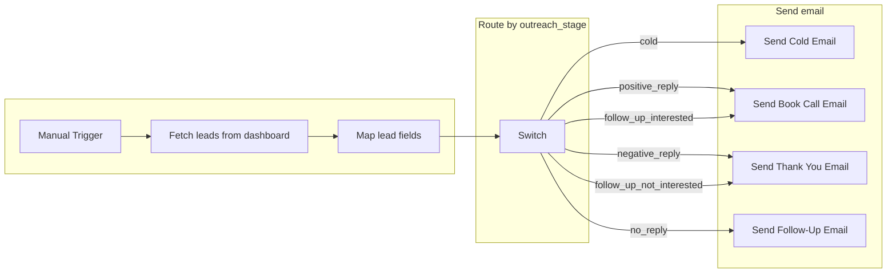

# n8n Lead Outreach – Visual Flow

**Workflow name:** Blocharch Lead Outreach – Email Automation

---

## Flow diagram (Mermaid)



---

## Linear view (top to bottom)

```
┌─────────────────────────┐
│   Manual Trigger        │
└────────────┬────────────┘
             │
             ▼
┌─────────────────────────┐
│ Fetch leads from        │
│ dashboard               │  →  GET {{ DASHBOARD_URL }}/api/n8n/leads
└────────────┬────────────┘
             │
             ▼
┌─────────────────────────┐
│ Map lead fields         │  →  Normalize: email, firstName, companyName,
│ (Code)                  │     website, outreach_stage, lead_id, practice_id
└────────────┬────────────┘
             │
             ▼
┌─────────────────────────┐
│ Route by outreach stage │  (Switch – 6 outputs)
└─────┬───┬───┬───┬───┬───┘
      │   │   │   │   │
      │   │   │   │   └── outreach_stage = "no_reply"
      │   │   │   │         └─► Send Follow-Up Email
      │   │   │   │
      │   │   │   └── outreach_stage = "follow_up_not_interested"
      │   │   │         └─► Send Thank You Email
      │   │   │
      │   │   └── outreach_stage = "negative_reply"
      │   │         └─► Send Thank You Email
      │   │
      │   └── outreach_stage = "positive_reply" OR "follow_up_interested"
      │         └─► Send Book Call Email
      │
      └── outreach_stage = "cold"
            └─► Send Cold Email
```

---

## Stage → email mapping

| Switch output                      | outreach_stage           | Email node              |
|-----------------------------------|--------------------------|--------------------------|
| Cold (first email)                | `cold`                   | Send Cold Email          |
| Positive reply → Book call        | `positive_reply`        | Send Book Call Email     |
| Follow-up interested → Book call | `follow_up_interested`  | Send Book Call Email     |
| Negative reply → Thank you        | `negative_reply`        | Send Thank You Email     |
| Follow-up not interested → Thank you | `follow_up_not_interested` | Send Thank You Email |
| No reply → Follow-up              | `no_reply`              | Send Follow-Up Email     |

---

## Nodes summary

| Node                    | Type        | Purpose |
|-------------------------|------------|--------|
| Manual Trigger          | Trigger    | Start run manually |
| Fetch leads from dashboard | HTTP Request | GET `/api/n8n/leads` (use `DASHBOARD_URL` env) |
| Map lead fields         | Code       | Normalize API response to `email`, `firstName`, `companyName`, `website`, `outreach_stage` |
| Route by outreach stage | Switch     | 6 branches by `outreach_stage` |
| Send Cold Email         | Gmail (OAuth2) | First contact (Part 1/2 staffing) |
| Send Book Call Email    | Gmail (OAuth2) | Positive / interested → book call |
| Send Thank You Email    | Gmail (OAuth2) | Negative / not interested |
| Send Follow-Up Email    | Gmail (OAuth2) | No reply → follow-up |

---

## Env / config

- **DASHBOARD_URL** – Base URL of your dashboard (e.g. `https://yourapp.vercel.app`). Used in “Fetch leads from dashboard”.
- **FROM_EMAIL** – Sender address (default in workflow: `jethro@blocharch.com`).
- **Gmail OAuth2** – Create one Gmail OAuth2 credential (jethro@blocharch.com) and assign it to all four Send nodes.
